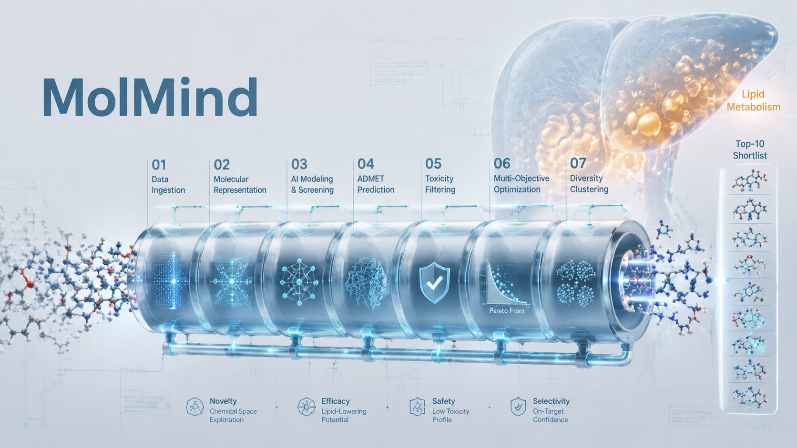

# MolMind

<p align="center">
  
</p>

<p align="center">
  <strong>MolMind</strong> · Auditable computational candidate prioritization · MASLD / HepG2-FFA<br />
  Public assays · toxicology evidence · multi-omics mechanism context<br />
  <a href="README.md">中文</a>
</p>

---

## What it does

**MolMind** is an **auditable computational candidate-prioritization system** for **MASLD / HepG2-FFA**. Given a compound library (a single `.sdf`), it ranks candidates from public activity, toxicology and multi-omics mechanism evidence, and emits a reproducible, traceable shortlist with mechanism hypotheses for wet-lab priority testing.

It is **not** a wet-lab-validated lipid-lowering or safety predictor. Top N is a computational prioritization layer; claims are bounded by `scientific_status` / `claim_ceiling`.

### The problem it targets

Fewer lipid droplets in a cell assay is not an automatic hit—if viability collapses, the lipid drop may be a death artifact. MolMind therefore adopts:

> **Valid hit = lipid-lowering ∧ low toxicity**  
> Lipid drop with high toxicity = **false positive** (reject early, do not patch afterward)

### Computational vs. experimental tracks

| Experimental (wet-lab validation) | Computational proxy (MolMind) |
|-------------------------------------|-------------------------------|
| Reduced lipid accumulation | Raise `S_lipid` (public activity + structural proxies) |
| Cell viability ≥ 80% (project provisional reference) | Lower `R_tox` + hard toxicity gate |
| Valid hit list | Gate-pass, then rank by `S_final` to emit Top N |
| SI / EC₅₀ / CC₅₀ | **Not computed, not written to CSV** (no dose–response → no false precision) |

In short: MolMind owns **reproducible, auditable prioritization**; efficacy and safety boundaries are confirmed in wet lab via **HepG2-FFA dual endpoints** (optional SI as a follow-up protocol only).

### Public-data import priority

Policy lives in [`data/public/registry.yaml`](data/public/registry.yaml):

| Wave | Sources | Claim boundary |
|------|---------|----------------|
| **1 Activity** | ChEMBL → PubChem BioAssay → BindingDB | Candidate endpoint / mechanism support; presence ≠ efficacy |
| **2 Toxicology** | ToxCast/Tox21 → DILIrank 2.0 → ToxRef/ToxVal | Risk signals only; no record ≠ safe |
| **3 Multi-omics** | GEO → PRIDE → metabolomics → LINCS/CMap | Mechanism/QC context only; default non-ranking |

Current snapshot (see [`data/public/README.md`](data/public/README.md)): PubChem **176** → **26** QC; ChEMBL **137** → **117** QC (**59** HepG2-FFA positive rows / 19 seed assays); BindingDB **74** → **71** QC; ToxCast/CTX **9** → **7** active QC (`risk_signal` only); DILIrank imported. EvidenceFacade merges QC tables by InChIKey; PubChem Active / BindingDB do not lift lipid `conf_e`; ToxCast active hits do not grant safety clearance. Failures stay `network_error` / `audit_missing` / `auth_missing` — never “inactive” or “safe”.

---

## How it works

### Quality-Max: one primary path + two runtime switches

Only **Quality-Max** (`mode=auto`) is exposed—no separate Online/Offline mode entry points:

```text
frozen local evidence snapshot → rules / GoldSet / optional ML → Critic → Top 10
any channel failure → auto-degrade, record degraded_channels[] → still emit a deterministic shortlist
```

| Switch | Default | Meaning |
|--------|---------|---------|
| **Use snapshot** `use_snapshot` | on | Read `data/evidence_snapshot/` |
| **Live evidence** `allow_live` | off | ChEMBL/PubChem live fill for shortlists only |

Delivery default: **snapshot on + live off**. To backfill evidence, run `bake-evidence` or temporarily enable live, bake, then rerun with live off.

Compatibility: `--mode online` / `mode=online` maps to `allow_live=true`; `offline` is a legacy alias only.

### Seven-stage agent pipeline

Not “one script, one CSV”—a staged, observable, auditable prioritization pipeline:

| Stage | Module | Role |
|-------|--------|------|
| 1 Ingest | `ingest` | Streaming SDF parse → descriptors / fingerprints / InChIKey |
| 2 Screening | `hard_filter` | Ro5 review, classified alert SMARTS, expert extreme red-lines |
| 3 Lipid scoring | `scorer_lipid` | Multi-signal fusion → `S_lipid` + attributions |
| 4 Toxicity scoring | `scorer_tox` | Multi-head fusion → `R_tox`; hard gate drops high risk |
| 5 Ranking | `ranker` | Public `S_final` formula + Murcko scaffold diversity caps |
| 6 Critic | `critic` | GoldSet reflection: drop non-novel or high-risk lookalikes |
| 7 Export | `export` + `mechanism` | Nomination CSV + screening-audit CSV + mechanism Markdown/PDF |

### Lipid: multi-signal fusion, not a single heuristic

Default `S_lipid` fusion (weights enter `config_hash`):

| Signal | Default weight | Meaning |
|--------|:--------------:|---------|
| Rules / pharmacophores | 0.35 | Pathway-aware SMARTS cues (e.g. DNL / FAO / AMPK) |
| Positive similarity | 0.30 | Tanimoto vs. GoldSet lipid-lowering, low-tox positives |
| External evidence | 0.25 | Via Evidence Facade (e.g. ChEMBL) |
| Optional ML | 0.00 | No validated lipid model is wired; interface retained without a constant-zero channel |

Empty evidence is never inflated into a high score; missing channels remain auditable.

### Toxicity: false-positive–first rejection

`R_tox` fuses structural alerts, DILI, ADMET, physicochemical risk, and tox evidence via a monotone “max head + weighted context” aggregation, with a conservative penalty for low confidence. GoldSet hepatotox analogs can receive a similarity boost. Defaults:

- **Hard gate** `R_tox >= 0.65` → reject  
- **Auto-admit cap** `R_tox < 0.45`; `0.45–0.65` → `review_required` (not auto Top 10)  
- **Scientific status is separate**: structural/physchem proxies may enter a `proxy_only` prioritization layer, but without direct safety evidence `safety_clearance_confidence=0` — never claim “low tox”  
- `viability_proxy = 0.80` is a **project provisional** experimental alignment cue and **does not fabricate SI**

Toxicity is first-class: a lipid-looking score cannot bury a high-risk molecule into the shortlist.

### Ranking: efficacy × safety × novelty × evidence confidence

```text
S_final = 0.40·S_lipid + 0.40·(1 − R_tox) + 0.10·novelty + 0.10·conf_e
```

- **Novelty**: near-positive similarity suppresses `novelty` (anti me-too)  
- **Scaffold diversity**: Murcko seat caps (default one seat per scaffold) prevent same-core monopolies in Top 10  
- **Evidence confidence** `conf_e`: mean retrieval quality—**not** biological novelty itself

### Critic: the agent’s reflection loop

Rule critic (on by default), typical actions:

- Near-identical to a library positive control → remove (reference drug ≠ new discovery)  
- Near-positive → soft-drop from Top, backfill a different scaffold  
- False-positive / hepatotox lookalike with high `R_tox` → remove  

An evidence-bound LLM critic path exists (may only cite `evidence_id`s already seen in the run); **ranking change is off by default**. The mechanism LLM only polishes Markdown **after ranking is frozen**.

### Evidence Facade: tool-using retrieval

Unified `EvidenceFacade.query()`:

- Versioned adapters (main path defaults: `chembl_lipid_v1` + `pubchem_tox_v1`)  
- Hits land in `attributions[]` / `evidence_id` and flow into CSV rationales  
- `prefer_snapshot=true`: skip the network when the local snapshot hits  
- HTTP timeout + consecutive-failure circuit breaker; failures append `degraded_channels[]`—no crash, no invented high scores  

### Reproducibility and audit trail

| Mechanism | Role |
|-----------|------|
| `config_hash` | Stable hash of rank/filter/model configs; written to CSV and API |
| Evidence snapshot | Shortlists can be pre-baked under `data/evidence_snapshot/` for offline replay |
| `degraded_channels[]` | e.g. `evidence_empty`, `lipid_ml`, circuit-open—degrades audibly |
| Attribution columns | Lipid/tox rationales and `overall_reason` trace back to signals and evidence IDs |

Acceptance criterion: **same SDF + same `config_hash` + same snapshot → same Top 10 IDs and scores**.

---

## What you get

### Artifacts of a run

| Artifact | Contents |
|----------|----------|
| **Nomination Top N CSV** | Default Top 10: IDs, factor scores, final score, rationales, `config_hash`, degrade flags, scientific claim bounds |
| **Mechanism Markdown/PDF** | Pathway-whitelist–anchored, testable hypothesis with citation / evidence-layer separation |
| **Live diagnostics** | Web / `POST /api/screen/stream` (NDJSON) / CLI stage progress |
| **Candidate / evidence / citation JSONL** | Full-score ledger, evidence provenance, selection audit |

See [`data/public/README.md`](data/public/README.md) for data-import waves and claim policy.

### Delivery surfaces (one configuration)

| Surface | Use |
|---------|-----|
| Web | Upload SDF in-browser; watch logs and nominations |
| API | Programmable screening, streamed logs, downloads |
| CLI | Batch one-shot CSV |
| Docker Compose | One-command stack for local / deploy replay |

### Intended result profile

A successful run is not “the ten most similar analogs with the highest raw score.” It aims for:

1. A shortlist that **passes the toxicity gate** with auditable evidence status  
2. A Top N that is **scaffold-diverse** and has novelty headroom vs. positives  
3. Results that are **explainable** (assay/evidence IDs, claim ceiling, mechanism plan)  
4. A **deterministic shortlist offline** when snapshots and the config fingerprint are fixed  

Mechanism prose aligns with wet-lab narrative: HepG2-FFA dual endpoints (lipid ↓ ∧ viability ≥ 80%); optional SI is a later confirmation protocol—**it never rewrites the computational ranking**. Do not describe computational eligibility as validated low-toxicity or lipid-lowering.

---

## Quick start

### Online demo (no local install)

Open **[https://molmind.cn/](https://molmind.cn/)** in a browser, upload an `.sdf`, and run screening.  
Health: <https://molmind.cn/health>.

### Local deploy

Full steps (China NAS registry first / ghcr / local build / pure Python): [deploy/README.md](deploy/README.md).

Recommended in China (pull prebuilt image; avoid slow overseas builds):

```bash
# One-time Docker Engine: insecure-registries: ["8.133.197.65:5001"]
docker pull --platform linux/amd64 8.133.197.65:5001/molmind:0.1.1
docker tag 8.133.197.65:5001/molmind:0.1.1 molmind:0.1.1
mkdir -p output
docker compose -f deploy/docker-compose.yml up -d
```

Local UI: <http://127.0.0.1:18765/> (health: `/health`). Do not open the static page via `file://`.

For local code changes only:

```bash
docker compose -f deploy/docker-compose.yml up --build
```

CLI one-liner:

```bash
python -m apps.cli.main --input data/sample.sdf --output output/nomination_top10.csv
```

Offline CLI smoke inside Docker:

```bash
docker compose -f deploy/docker-compose.yml run --rm cli
```

Mechanism Markdown defaults to the accurate template (**Top 10 unchanged**); the LLM client remains for optional/compat use only.

---

## Repository layout

| Path | Description |
|------|-------------|
| `apps/` | API, CLI, static Web UI |
| `services/` | Pipeline, scoring, evidence, critic, mechanism |
| `packages/` | Chem core, goldset, optional ML, shared records |
| `configs/` | Filter / score / rank weights and model manifest (`config_hash`) |
| `data/` | Sample SDF, goldset, evidence snapshots, `public/` registry workspace, reference tables, optional models |
| `deploy/` | Dockerfile, Compose, deploy notes |
| `scripts/` | Smoke, config gates, evidence bake utilities |
| `tests/` | Unit / regression / integration (pytest) |

---

## Tests

```bash
pytest
```
